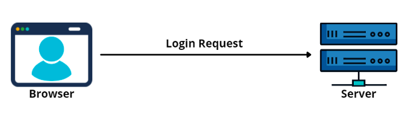
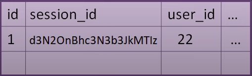
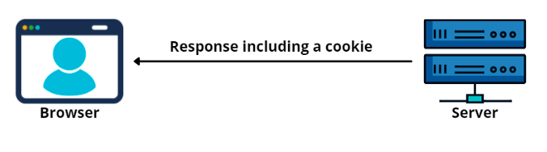

# Authentication - Identification

# If authenticate(request) is OK

## 1. Server create session in database

## 2. Server send session_id in cookies

## 3. Client save domain : cookies and send them with each request

## 4. When user logout the server delete session from database

# Authorization - getting access to some things
