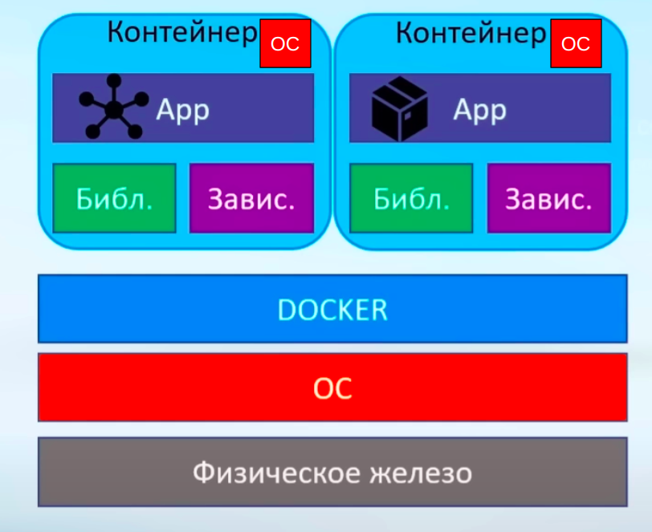
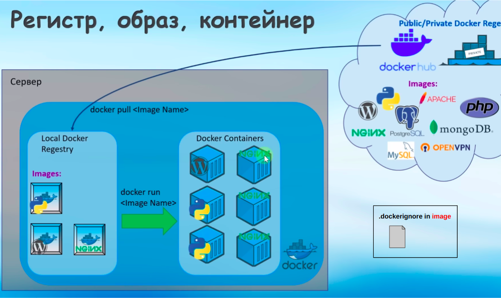
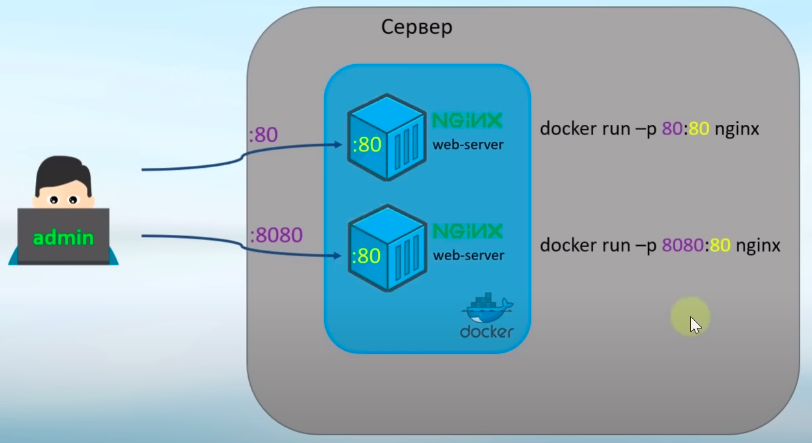
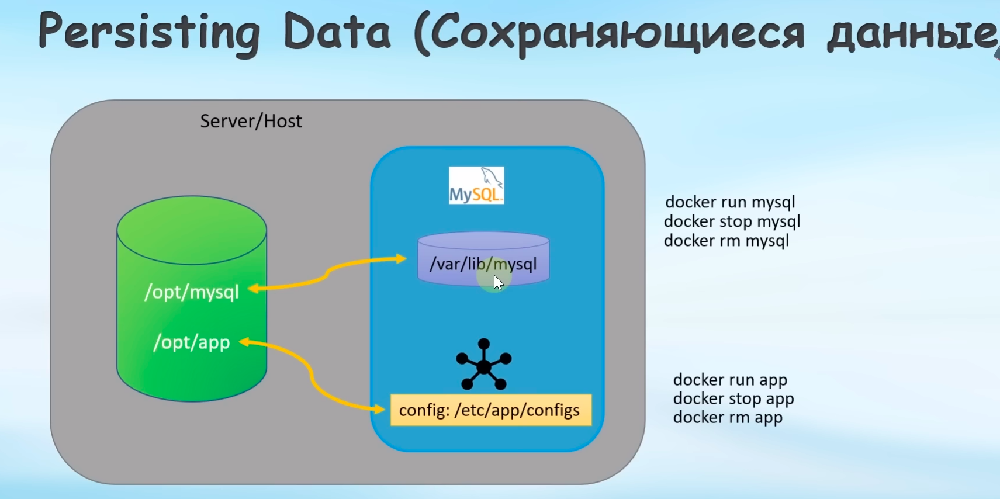
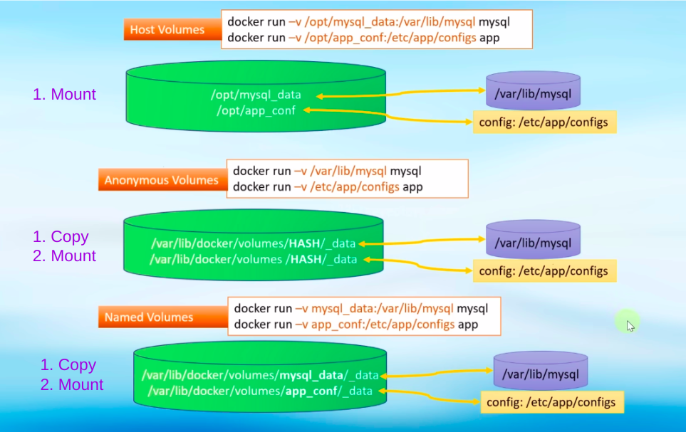
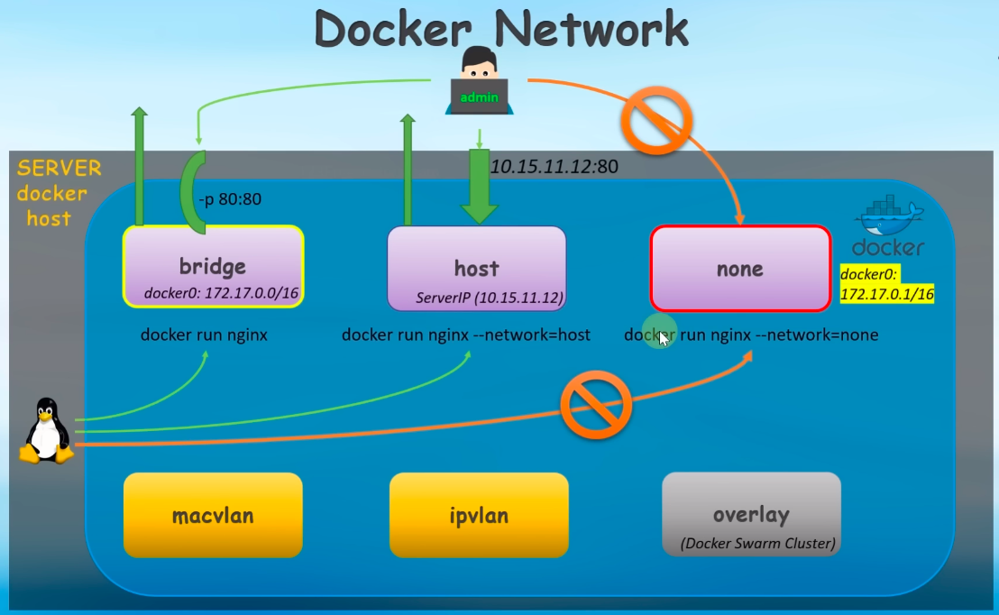
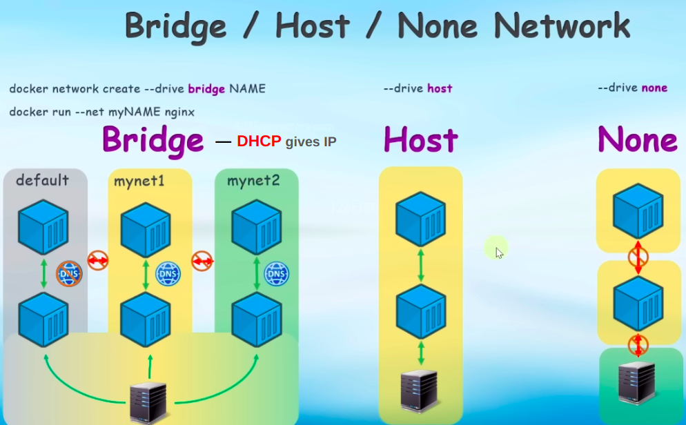
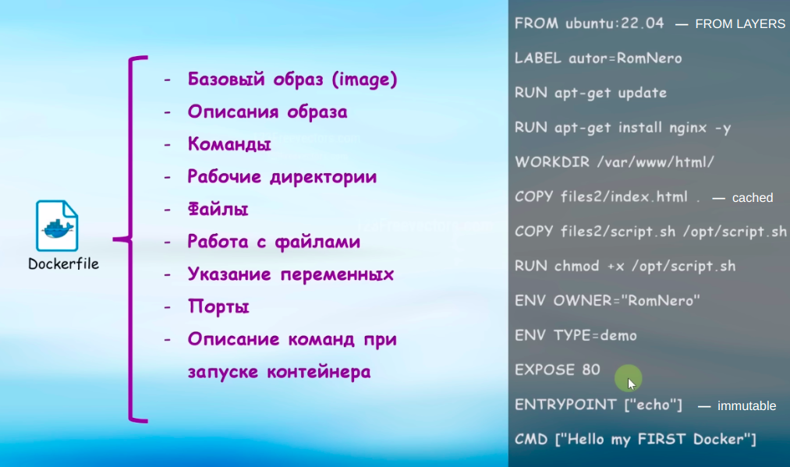
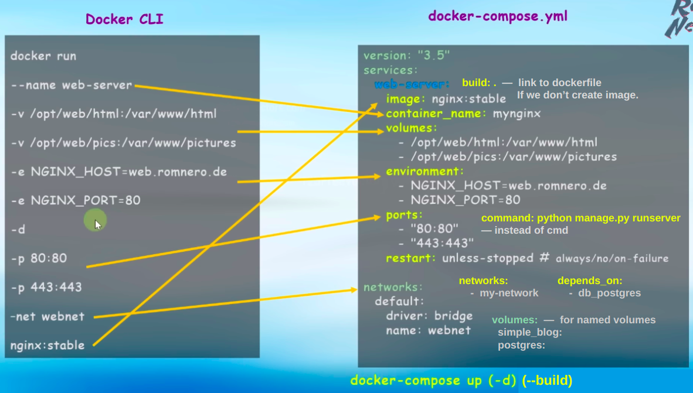
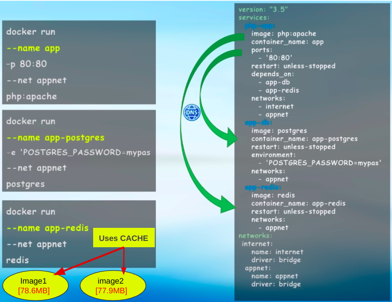

# Docker

### docker

* docker --version
* docker pull "image"
* docker run -d --rm -it --name "container" -p 80:80 -p 433:80 -e NAME=Vlad 
-v app:/var/www/html "image:version" --net my-network "cmd in container"
* docker exec -it "container" /bin/bash or "immediately in workdir"
* docker system prune -a --volumes — remove all stopped or useless images & containers

 

* docker ps -a
* docker rm -f "container"

 

* docker images
* docker rmi "image"

 

* docker kill "container"
* docker pause / unpause "container"
* docker stop / start / restart "container"

 

* docker logs -f "container" — updated
* docker stats "container" — CPU | Memory
* docker inspect "container"

 

* docker volume ls
* docker volume rm "volume"
* docker volume prune
* docker volume create "volume_name"

 

* docker network ls
* docker network rm "network"
* docker network inspect "network"
* docker network connect / disconnect "network" "container"
* docker network create "network_name" -d bridge 
--subnet "192.108.10/24" --gateway 192.108.10.1 --ip-range
(***--net*** for containers)

 

* docker tag <image> <new_tag>
* docker build . -t my_image:v01

### docker compose

* docker compose build .
* docker compose up -d --build 
* docker compose down -v
* docker compose logs -f
* docker compose stop / start / restart

### system

* useradd -m -s /bin/bash "username"
* usermod -aG docker "username"

 

* sudo su -
* sudo -i -u emurze
* chmod +x manage.py

 

* service docker status
* service docker stop / start / restart

 

* env
* ps xa
* netstat --tuplen
* ip a | ifconfig
* curl -Li "ip | domain"
* gnome-system-monitor
