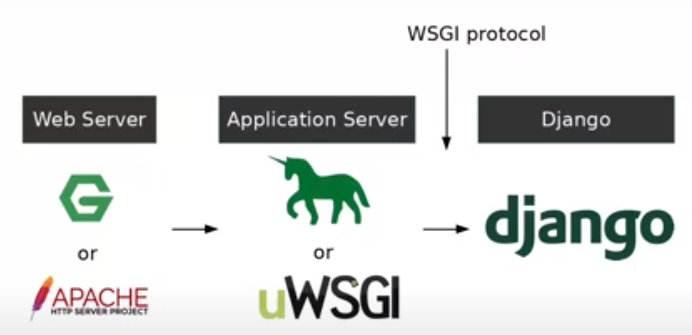
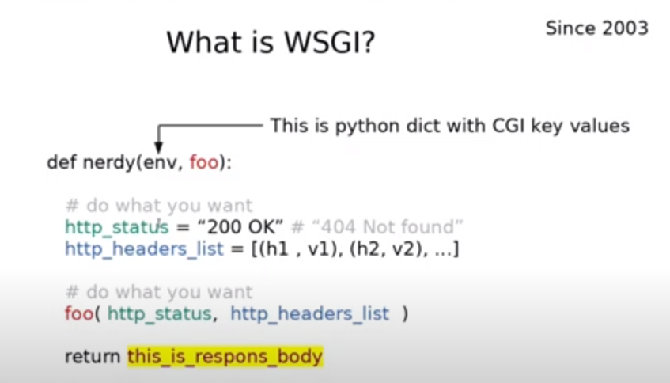
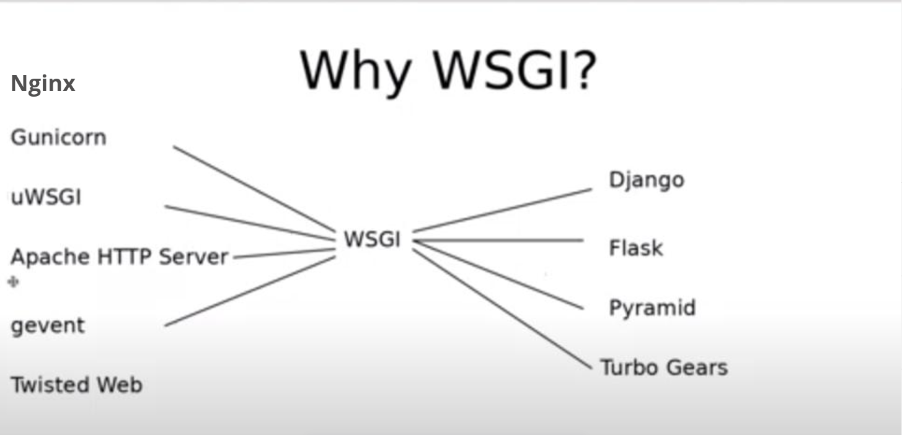
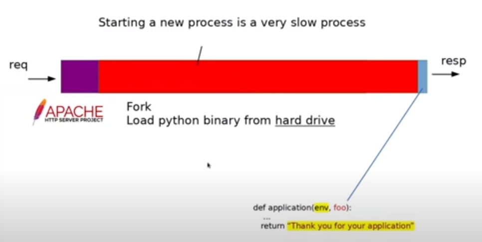

# Gunicorn, WSGI, and Nginx 

### WSGI - Web Server Gateway Interface

* It stays between any server and application

* Specification for prefork server creators

### Application Server *preforks python application*

* because of large forking time

* It's Gunicorn or uWSGI

