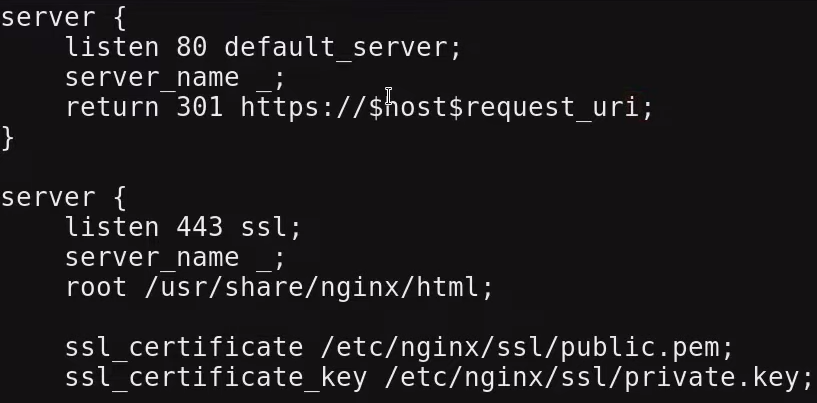
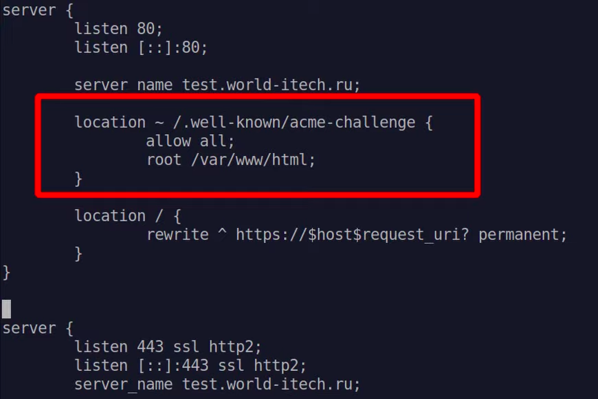
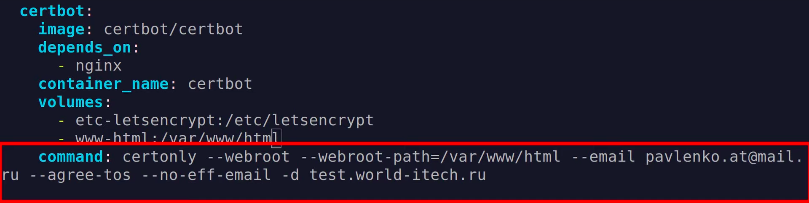
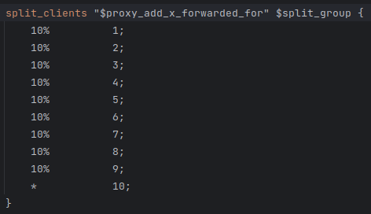
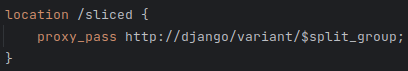
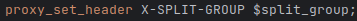
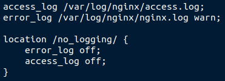
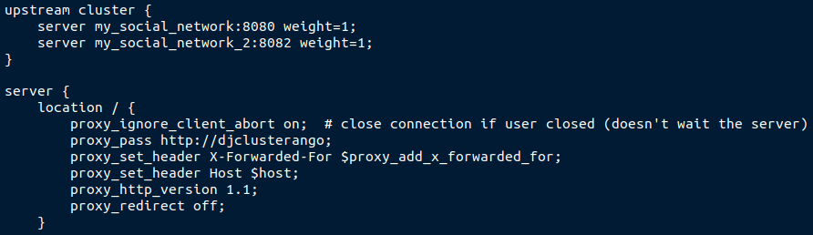
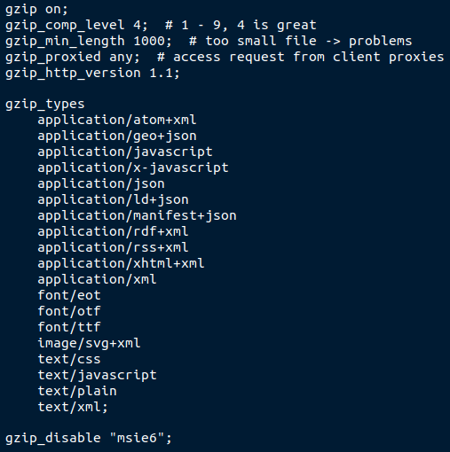
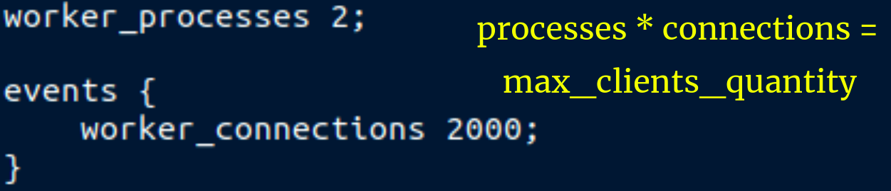

# Nginx

### DNS

### SLL

### A/B Testing

### Logging

### BALANCE LOADING

### Cache - USE DJANGO CACHE

### GZIP

### NGINX WORKERS

### HTTP1.1 or HTTP2 ( ASGI )

### VARS

* string | int | bool
* set age 7
* $age
* decomposition "include /etc/nginx/mime.types"

### Location ( paths relative to the root )

* uri to path 
* location extends that uri paths
* using with root | alias
* nginx finds server by host or uses default_server
* =, ^=, ~* | ~, /

### PATHS

* /var/log/nginx
* /etc/nginx/nginx.conf
* /srv/

### COMMANDS 

* nginx -t 
* nginx -s reload
* nginx -s reopen