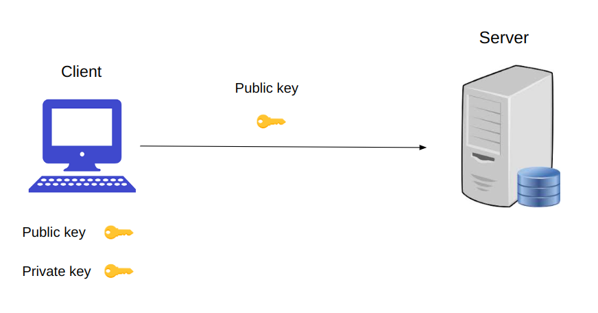
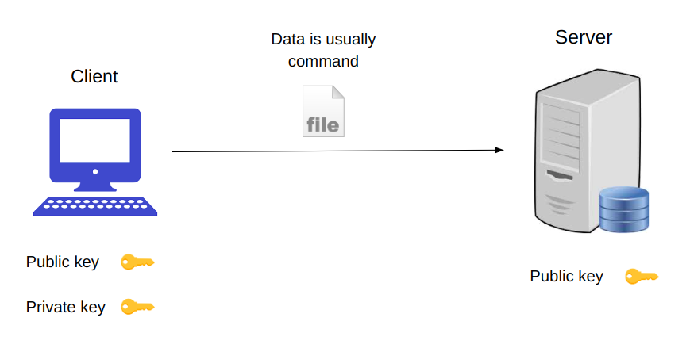
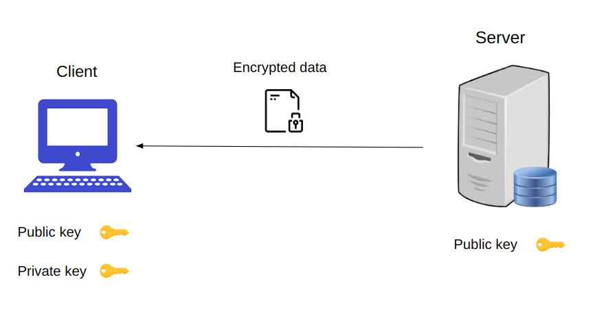
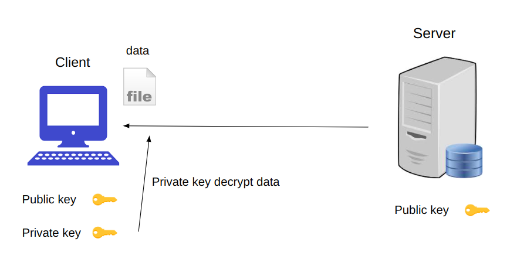
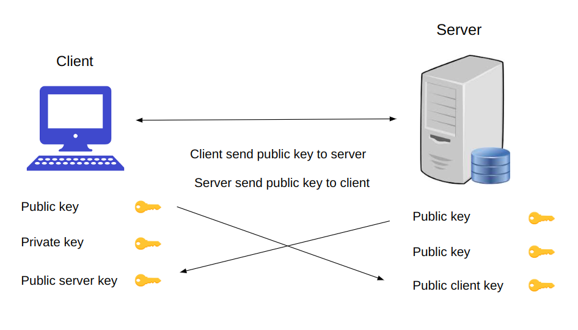
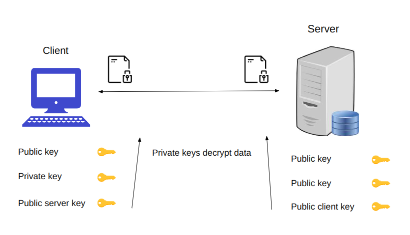
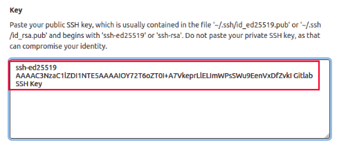

# SSH









# SSL





## Public key encrypts data
## Private key decrypts data


# How to use?

### Generate ssh key to ~/.ssh/

```
ssh-keygen -t ed25519 -C "Gitlab SSH Key"
```

### Add publish ssh key to gitlab




### Set ~/.gitconfig
```
git config --global user.name "your_username"
git config --global user.email "your_email_address@example.com"
```