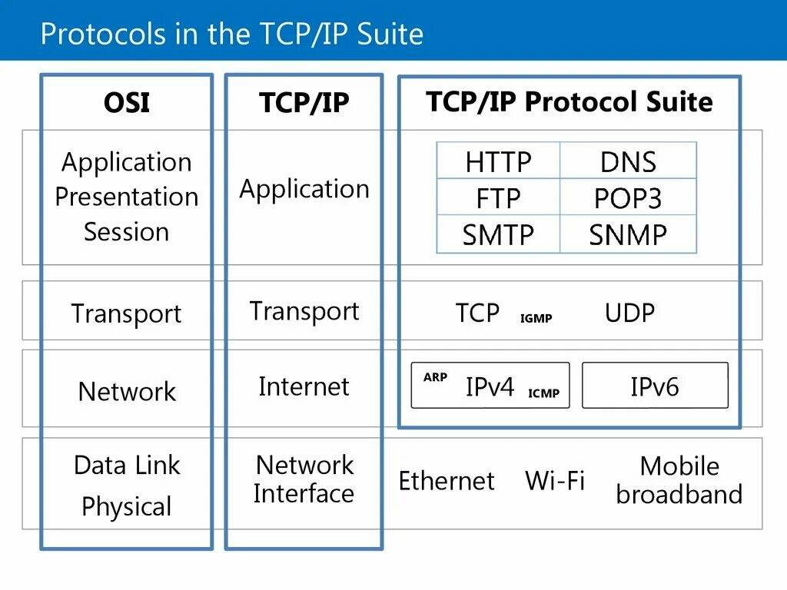

<h1>Model TCP / IP </h1>
<h3 style="display: inline-block;">
    Model TCP / IP 
    — network model describing the process of digital data transmission.</h3>
<h5 style="display: inline-block;"></h5>

    

    <h2 style="margin: 0 0 15px 0">Application layer</h2>
    <ol style="display: block; margin: 0 0 20px 0;">
        <li>Provides protocol processing.</li>
    </ol>
    <h3 style="display: block; margin: 8px 0;">RFC — Request for Comments</h3>
    

        A document from a series of numbered Internet information documents.
    

    <h3 style="display: block; margin: 8px 0;">Telnet — teletype network</h3>
    

        Is a client/server application protocol that provides access to virtual 
        terminals of remote systems on local area networks or the Internet. 
        Unsafe - without encryption.
    

    <h3 style="display: block; margin: 8px 0;">TLS — Transport Layer Security</h3>
    

        TLS provides secure internet communications between a client and a server 
        with a one key for client and one for server. 
            Providing data integrity by supporting authentication code. 
            It ensures that all information will reach its destination 
            without any loss or alteration from third parties.
        Improving search engine optimization (SEO).
    

    <h3 style="display: block; margin: 8px 0;">HTTP — HyperText Transfer Protocol</h3>
    

        Protocol that allows to communicate client with server. All other layers are hidden. 
        Client is ( user-agent — [ browser | another app ] or proxy — [ router | server ] )
    

    

        <ol style="display: block; margin: 0;">
            <li>HTTP ( Keep alive ) - persistent connection. And the range of the other headers. </li>
            <li>Set in response and get in request Cookies. It is mainly tokens because data stored on server.</li>
            <li>WebSocket - protocol that allows set permanent bidirectional connection. 
                We can send and accept messages without http-request.</li>
        </ol>
    

    <h3 style="display: block; margin: 8px 0;">IMAP — Internet Message Access Protocol</h3>
    

        Protocol for receiving messages only. 
        Provides possibility that mail client can get access to messages on mail server. 
        Messages are updated in real time. 
        Mail clients leave messages on the server until the user explicitly deletes them.
    

    <h3 style="display: block; margin: 8px 0;">SMTP — Simple Mail Transfer Protocol</h3>
    

        Technical standard for transmitting electronic email over a network.
    

    <h3 style="display: block; margin: 8px 0;">FTP — File Transfer Protocol</h3>
    

        Provides a reliable and efficient medium of transmitting large amounts of data 
        and transfer speed (up to 16 Gbps). 
        Uses for organizations that require high-performance data access.
    

    <h3 style="display: block; margin: 8px 0;">SNMP — Simple Network Management Protocol</h3>
    

        SNMP is designed to allow administrators to monitor and configure network 
        devices remotely it can also be used to penetrate a network. A significant 
        number of software tools can scan the entire network using SNMP.
    

    <h3 style="display: block; margin: 8px 0;">DNS — The Domain Name System</h3>
    

        Humans interact with internet via domain names (like “www.example.com”), 
        while browsers interact through Internet Protocol (IP) addresses. 
        DNS translates domain names to IP addresses so that browsers could load the resources. 
    

    <h2 style="margin: 30px 0 15px 0">Transport layer</h2>
    <h3 style="margin: 0 0 8px 0;">TCP — Transmission Control Protocol</h3>
    

        It provides a channel for the communication needs of applications.  
        Always waits packets (flag FIN) and doesn't drop connection because ( keep-aline ). 
        Using in banks, social networks, articles where accuracy is important.
    

    <ol style="display: block; margin: 0 0 10px 0;">
        <li>Ensures correct data (send extra confirmation if data is gone).</li>
        <li>Ensures packets order.</li>
        <li>Provides Algorithm:
        

            That takes a certain number of packets every time. 
            If data came quickly then algorithm increases number of packets at a time 
            else it remains the same.:
        

            <ul style="margin: 2px 0 6px 0">
                <li>low max number of packets sent if low internet speed.</li>
                <li>high max number of packets sent if high internet speed.</li>
            </ul>
        </li>
        <li>Discards duplicate data.</li>
        <li>Uses MSS - Maximum Segment Size which host can accept.
        
МSS = IP MTU - IP title (20 bytes) - TCP title (20 bytes) ≈ 1460 bytes.
</li>
    </ol>
    <h3 style=" margin: 0 0 8px 0;">UDP — User Datagram Protocol</h3>
    

        The basic transport layer protocol, 
        providing an unreliable connectionless datagram service. 
        UDP is using in games, videos, audios where accuracy is not so important.
    

 

    <h2 style="margin: 15px 0 15px 0">Network layer</h2>
    <h3 style="display: inline-block; margin: 0;">IP — Internet Protocol</h3>
    
Allows local networks communicate with another local networks via WHA.

    <ol style="display: block; margin: 0 0 32px 0;">
        <li>Provides access to global network.</li>
        <li>Cares about crashes.</li>
        <li><h5>Puts in frame<h5>
            <table>
              <tr style="text-align:center">
                <td>MAC-address</td>
                <td>IP</td>
                <td>TCP</td>
                <td>Data</td>
              </tr>
              <tr style="vertical-align: top;">
                <td>To | From</td>
                <td>To | From | TTL</td>
                <td>
                    <ul>
                        <li>Source port</li>
                        <li>Destination port</li>
                        <li>SYN ( Sequence number ) - controls order.</li>
                        <li>ACK ( Acknowledgement number ) - confirm number.</li>
                        <li>Data offset - title length</li>
                        <li>Reserved</li>
                        <li>Flags</li>
                        <li>Window size - the number of bytes of data that the sender of this packet is ready to accept.</li>
                        <li>Checksum - Using for checking on errors</li>
                        <li>Urgent pointer - If the data is urgent then send them immediately as they arrive.</li>
                    </ul>
                </td>
              </tr>
            </table>
        </li>
        <li>Uses MTU - Maximum Transmission Unit or Max packet size in bytes. 
        
Average = 1500 bytes.
</li>
        <li>Divides data block into packets.</li>
        <li>Use gray and white addresses with NAT.</li>
        <li>Algorithm:
            <ul>
                <li>Get closer ip from ARP.</li>
                <li>Get MAC-address from ARP table or 
                    
Via extra request to router, but algorithm must know the IP.

                    
Send network-wide issue

                    <ul style="margin-bottom: 8px">
                        <li>Who is responsible for this IP? I need get your MAC-address.</li>
                        <li>If there is no response then there is no network.</li>
                        <li>If exists MAC-address then sending is allowed.</li>
                    </ul>
                </li>
                <li>Send frame to MAC-address</li>
                <li>PC: It's my MAC-address. Ohh no! | discarding frame.</li>
                <li>Router: Ok data. if host is in the same network then I will send frame to closer host 
                    
else to closer network (in another router)
</li>
                <li>Get closer IP from ARP ... </li>
            </ul>
        </li>
    </ol>
    <h3 style="display: inline;">TTL — Time to live</h3>
    

        Each packet has own TTL that decrements each transition through routers.  
        If TTL = 1 then router discards it.
    

    <h3 style="display: inline;">DHCP — Dynamic Host Configuration Protocol</h3>
    

        Routers has DHCP. It gives temporary(24h) ip for new devices or 
        update temporary(24h) ip for connected devices. 
        Static ip you can manually configure.
    

    <h3 style="display: inline;">ARP — Address Resolution Protocol</h3>
    

        Communication protocol used for discovering the link layer address,  
        such as a MAC address, associated with a given internet layer address.
    

    <h3 style="display: inline;">ICMP — Internet Control Message Protocol</h3>
    

        The network layer protocol used to transmit control messages between hosts  
        and routers to report whether hosts are reachable and routes are available.
    

    <h3 style="display: inline;">IGMP — Internet Group Management Protocol</h3>
    

        Communications protocol used by hosts and routers on IPv4 networks 
        to establish multicast group memberships. IGMP allows the network 
        to direct multicast transmissions only to hosts that have requested them.
    

    <h3 style="display: inline;">NAT — Network Address Translation</h3>
    

        Service that operates on a router to connect private networks to public networks. 
        With NAT, an organization needs one IP address or one limited public IP address 
        to represent an entire group of devices as they connect outside their network.
    

 

    <h2 style="margin: 15px 0 15px 0">Network Interface layer</h2>
    <h3 style="display: inline-block;">
        Network Interface
        — provides connection and organizes network.</h3>
    <ol style="display: block; margin: 0 0 22px 0;">
        <li>Provides the same: 
            <ul>
                <li>Radio frequency</li>
                <li>Speed</li>
                <li>Light</li>
                <li>Voltage</li>
            </ul>
        </li>
        <li>Provides Async access.
            <ul>
                <li>
                    CSMA/CD - faster, but with сollision. 
                    Ethernet, WiFi
                </li>
                <li>
                    Token - slower, but without collision.  
                    Used with big data where collision is expensive.
                </li>
            </ul>
        </li>
        <li>Has MAC-address</li>
    </ol>
    <h3 style="display: inline;">MAC-address — Media Access Control</h3>
    

        Unique identifier assigned to a network interface controller (NIC) 
        for use as a network address in communications within a network segment. 
        Without MAC-address we cannot get access to send packets. 
    

    

        <h3 style="display: inline-block; margin: 0;">Modem</h3> 
        <ul style="font-size: 14px; margin: 5px 10px 5px 5px;">
            <li>Hasn't IP</li>
            <li>Has 1 client</li>
            <li>Uses connected device ip</li>
        </ul>
    

    

        <table style="display: inline-block; width: 120px;margin: 8px 0 0 0;">
            <tr><td>Provider</td></tr>
            <tr><td>Modem</td></tr>
            <tr><td>Router</td></tr>
            <tr><td>Hosts</td></tr>
        </table>
        <table style="margin: 8px 0 5px 0;">
            <tr><td>Provider</td></tr>
            <tr><td>Router ( Modem + Router )</td></tr>
            <tr><td>Hosts</td></tr>
        </table>
    

 

    <h2 style="margin: 20px 0 20px 0 ">REPEAT</h2>
    <ol style="display: block; margin: 0 0 22px 0;">
        <li>
            
                Application layer
                - 1 function
            
            <ul>
                <li>RFC</li>
                <li>Telnet</li>
                <li>TLS</li>
                <li>HTTP</li>
                <li>IMAP</li>
                <li>SMTP</li>
                <li>FTP</li>
                <li>SNMP</li>
                <li>DNS</li>
            </ul>
        </li>
        <li>
            
                Transport layer
                
                    - 5 funtions
                
                <ul>
                    <li>МSS</li>
                </ul>
            
        </li>
        <li>
            
                Network layer
                - 7 functions
                <ul>
                    <li>MTU</li>
                    <li>TTL</li>
                    <li>DHCP</li>
                    <li>ARP</li>
                    <li>ICMP</li>
                    <li>IGMP</li>
                    <li>NAT</li>
                </ul>
            
        </li>
        <li>
            
                Link ( Network Interface layer )
                - 3 functions
            
            <ul>
                <li>MAC-address</li>
                <li>Modem Pattern</li>
            </ul>
        </li>
    </ol>

    

