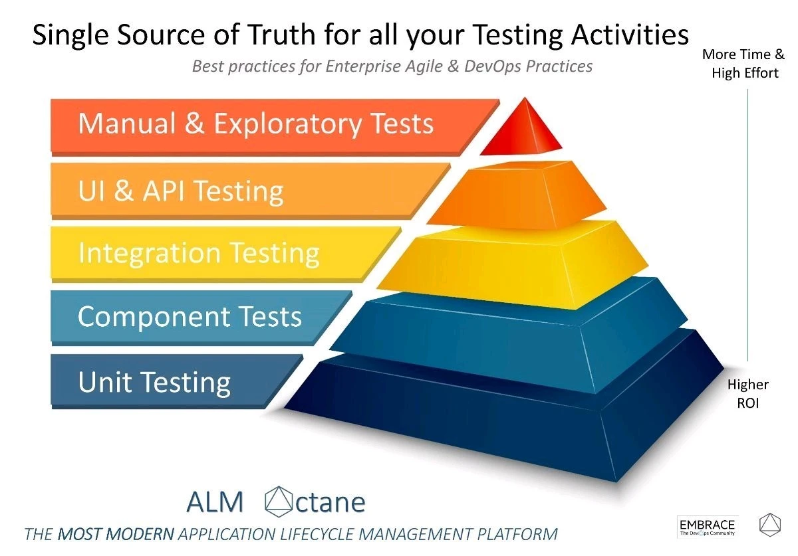

# TDD



* Manual <span style="color: white">QA-Task</span>

* Functional Tests - <span style="color: white">QA-Task</span> | <span style="color: #00bfff">Dev-Task</span> have User History and Human-names

* Integration Tests - <span style="color: #00bfff">Dev-Task</span> Tasks between units or modules. Access to unit is not required.

* Component Tests - <span style="color: white;">QA-Task</span> ( black-box testings, comes after unittests, Is not docs for future use )<br>
Detailized func test

* Unittests - <span style="color: #00bfff">Dev-Task</span> ( white-box, should contain great project docs ) - <br>
<span style="color: green;">Checks correctness of the 1 unit of behavior if not then it's integration test</span> Access to unit is required

## Dev pyramide


# Django


## View

* test url
```
resolver = resolve('/')
self.assertEqual(resolver.func.view_class, HomePageView)
```

* test template
```
# manual
request = HttpRequest()
request.user = AnonymousUser()
request.method = 'GET'
response = HomePageView.as_view()(request).render()
self.assertEqual(
    response.content.decode('utf-8'),
    render_to_string('home_page.html')
)
# or
response = self.client.get('/')
self.assertTemplateUsed(response, '<template_name>')
```

* test redirect
```
response = self.client.post('/', data={})
self.assertEqual(response.status_code, HTTPStatus.FOUND)
self.assertEqual(response['LOCATION'], '/')
```

* behavior integration tests ( can create item, etc )
```
| can create post
|
| show post when necessary
|
| can display items
```


## Model

* integration test create and retrieve
```
# create
ListItem.objects.create(content='item_1')
ListItem.objects.create(content='item_2')
# count
self.assertEqual(2, ListItem.objects.count())
# retrieve
item_1, item_2 = ListItem.objects.all()
self.assertEqual(item_1.content, 'item_1')
self.assertEqual(item_2.content, 'item_2')
```

## Form

* unittests checking constraints
```
class ToDoCreateItemFormTest(TestCase):
    def test_content_maxlength_constraint(self) -> None:
        form = TodoCreateItemForm(data={'content': 'New item' * 200})
        self.assertIn(
            'Ensure this value has at most 256 characters',
            str(form.errors['content']),
        )
```

* integration tests
```
def test_get(self) -> None:
    response = self.client.get('/')
    html = response.content.decode('utf-8')

    self.assertEqual(response.status_code, HTTPStatus.OK)
    self.assertIn('<h2>Add Item</h2>', html)
#
def test_post_success(self) -> None:
    response = self.client.post('/', data={'content': 'Hi'})

    self.assertEqual(response.status_code, HTTPStatus.FOUND)
    self.assertEqual(response['LOCATION'], '/')
#
def test_post_error(self) -> None:
    response = self.client.post('/', data={'content': 'Hi' * 600})
    html = response.content.decode('utf-8')

    self.assertEqual(response.status_code, 200)
    self.assertIn('Ensure this value has at most 256 characters', html)
```


## Mixin

* unittest
```
class TestHomePageItemsListMixin(TestCase):
    """Unittest"""

    class Mixin(ListItemMixin, TemplateView):
        template_name = 'home_page.html'

    def setUp(self) -> None:
        self.view = self.Mixin()

    def test_context_data_items(self) -> None:
        context = self.view.get_context_data()
        self.assertIsInstance(context['items'], QuerySet)
```

## Commands

```
coverage run manage.py test

coverage report
```
